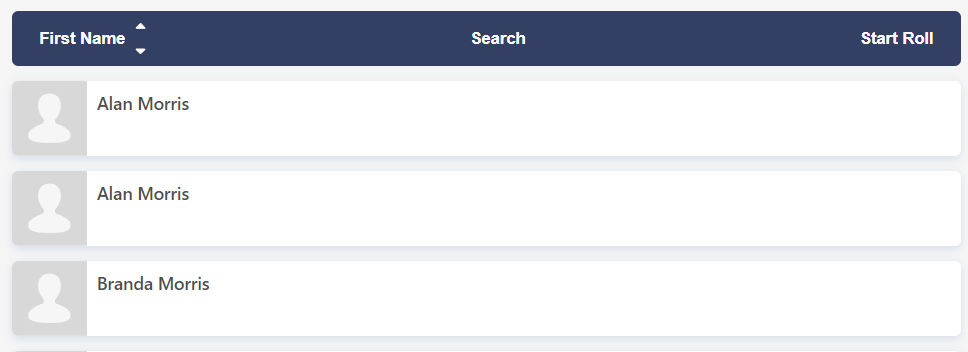
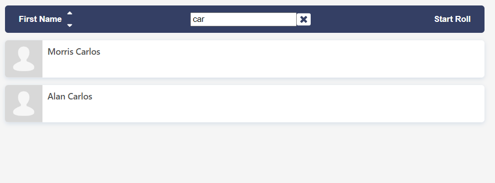
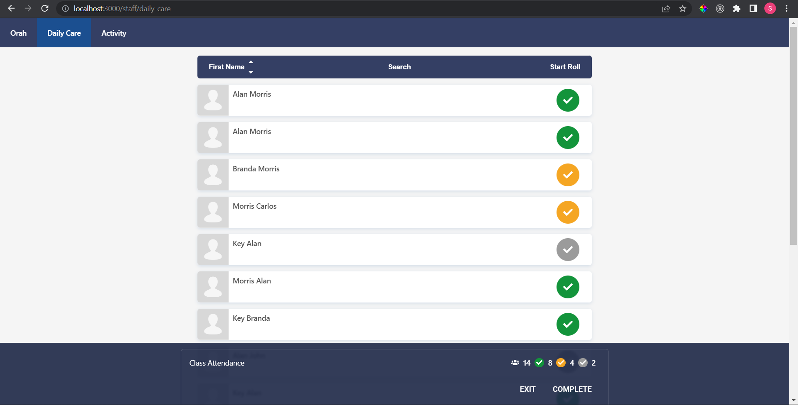
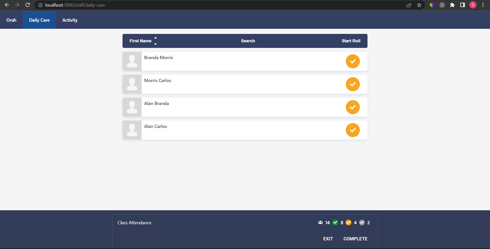
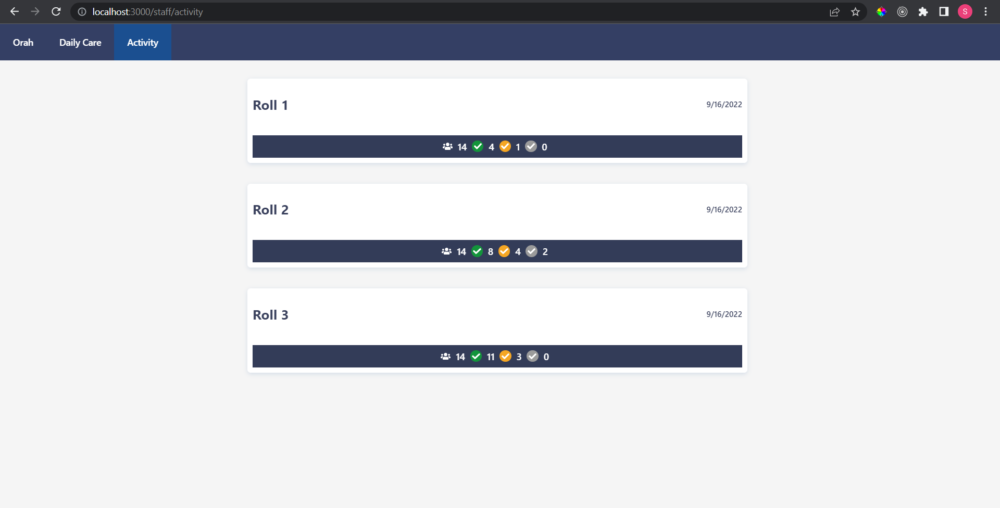
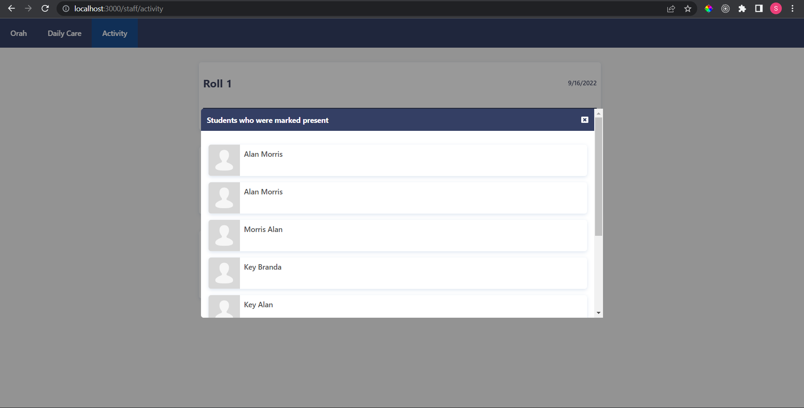

# Front End Engineering Test
At Orah, most of our services are written in Javascript/Typescript. New features on the web are written in React with Typescript. This project will give you an idea of the codebase you will be working with as a front end engineer at Orah.

## Approach
My approach to the solution was to create a studentContext.tsx where student data and student roll data will be maintained. app.tsx is the Context Provider and the routes underneath it are Context Consumers (Home Board and Activity page). 

This project is written in React with Typescript. I've used [styled-component](https://styled-components.com/docs/basics#getting-started) for styling in this project. 

## Tasks
### 1. Implement search and sort of students
Implemented an efficient way to sort and search the list of students. Implemented a sort toggle (switch between ascending or descending order) as well as a way to switch between sort by first name or last name.



Toggle 'Search' enables user to search students according to their full name.



### 2. Displaying a roll summary
Clicking on "Start Roll" will enter the roll mode which would display a roll state icon for each student in the list. You can click on the icon to switch between "Present", "Late", "Absent" state. In this mode, you will also see a dark blue overlay shown at the bottom of the page which displays the summary of different roll states and the number of students.



### 3. Filter students based on roll state
When clicking on each roll state icon, it filters the list of students to only the ones with the matching roll state. Used context to store the students roll data.



### 4. (BONUS) Save the current roll and display it in activity page
After clicking on the "Complete" button, a snapshot of student roll is saved using `save-roll`. The list of rolls we have completed is fetched by calling the `get-activities` route.



Each activity roll shows the number of students that were "Present", "Late" or "Absent". By clicking on any of these roll state icon, it will load a modal UI which shows the appropriate students with that roll status.



## How to run
You will need to have Node **10.16.0** or later on your local development machine. You can use [nvm](https://github.com/creationix/nvm#installation) (macOS/Linux) or [nvm-windows](https://github.com/coreybutler/nvm-windows#node-version-manager-nvm-for-windows) to switch Node versions between different projects.

### First install all dependencies
```sh
cd front-end && npm i
```

### To start the local server
```sh
npm start
```

### Open app in browser
Once the app is compiled and bundled successfully you should see this screen in your browser. This would be your starting point of the project.


## Project structure
Open the project in VSCode as a workspace and install the recommented plugins:

- `vscode-eslint` for linting
- `prettier-vscode` for formatting
- `vscode-styled-components` for auto-completing and syntax highlighting of styled-components code

You should see the project is structured as follows:

```
.
└── front-end
    └── src
        ├── api
        ├── assets
        │   └── images
        ├── shared
        │   ├── components
        │   ├── helpers
        │   ├── hooks
        │   ├── interfaces
        │   ├── models
        │   └── styles
        └── staff-app
```

### src/api

This is the place for all "backend routes". There is no actual backend with database connection for this project. The routes in here use `localStorage` to store data, and will return a `Promise` with data that will be resolved at random timeout between 0.5 to 2 seconds. Some of the routes would also return unsuccessful responses to simulate the real world scenario.

### src/assets

A place for all kinds of assets used in code such as images.

### src/shared

This folder contains some of the shared components/hooks/styles across multiple apps.

For example there is a `useApi` custom hook under `src/shared/hooks` to simplify the communication with the backend. You need to specify the url (and params for `POST`) in the `useApi` params. It will return you the nessary function and state you need to display the data returned from the backend as well as handling of loading and error state.

```tsx
const [getStudents, data, loadState] = useApi<{ students: Person[] }>({ url: "route" })
```

### src/staff-app

This is the React app for staff users.
